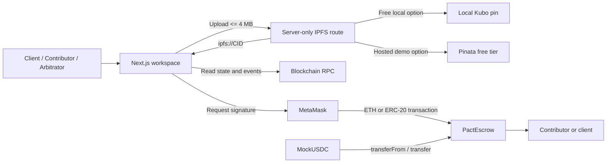
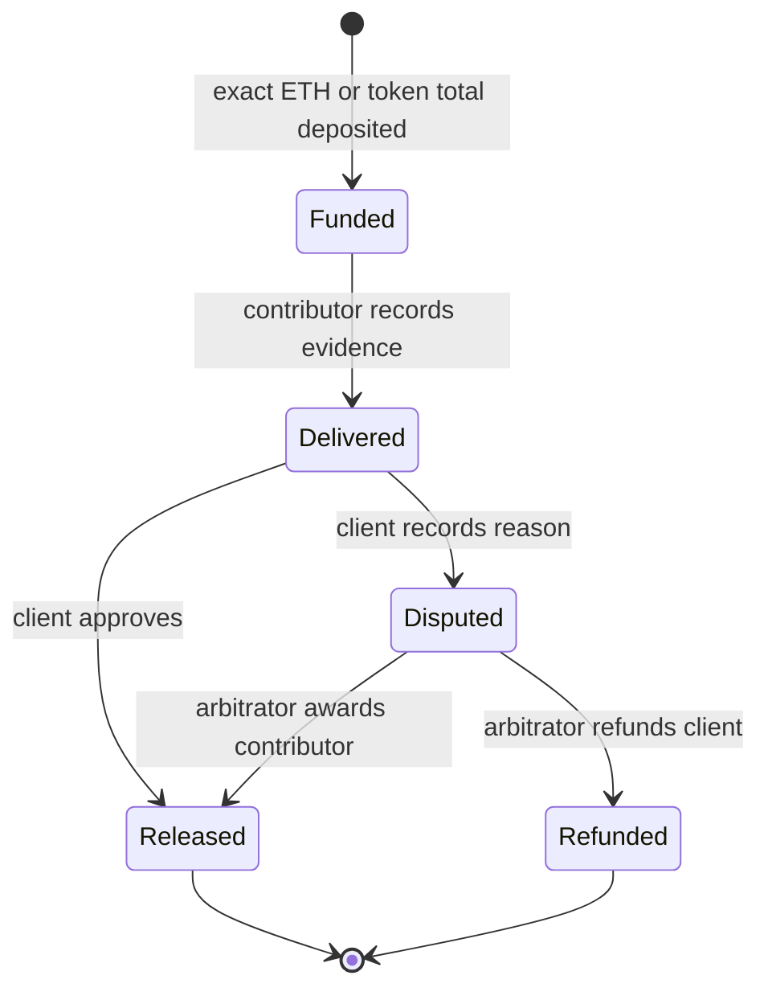

# One agreement, one on-chain source of truth

No application service can move escrowed funds. The upload route handles public file pinning only; it has no wallet or private key. Contract state is authoritative and the UI re-reads it after confirmation.

## Asset model

`Job.token == address(0)` selects native ETH. Any nonzero token selects ERC-20 accounting for that job. The original payable `createJob` function remains separate from `createTokenJob`.

Token creation checks the contract's balance before and after `safeTransferFrom`; the increase must equal the milestone total. This rejects fee-on-transfer deposits. Settlement updates state and accounting before transfer, under `ReentrancyGuard`; a failed ETH or token transfer reverts the entire transaction.

For each job:

`remaining = total − released − refunded`

Different assets are never numerically aggregated in the UI. Workspace cards show values for the selected agreement and its token metadata.

## Reputation model

Reputation belongs to the freelancer address and changes only inside successful release settlement:

- `releasedMilestones += 1` for every client-approved or arbitrator-released milestone;
- `completedJobs += 1` only when `released == total` and `refunded == 0`;
- `score = releasedMilestones + completedJobs × 5`.

There are no stars or subjective ratings. Failed transfers revert reputation along with payment state. The score is evidence of releases, not identity, quality, or resistance to collusion.

## IPFS boundary

The browser sends one file to same-origin `/api/ipfs`. The route limits it to 4 MB and pins through either a server-local Kubo RPC or a server-only Pinata JWT. It validates the returned CID and sends only `ipfs://CID` to the browser. The client then includes that URI in an ordinary contract transaction.

Kubo RPC is admin-level and must stay on loopback/private infrastructure. Pinata credentials never use a `NEXT_PUBLIC_` name. Direct HTTPS or `ipfs://` input bypasses uploading and remains supported.

## State transitions

Each milestone transitions independently and can settle once. Client-side role controls improve UX; the contract independently enforces every permission.
