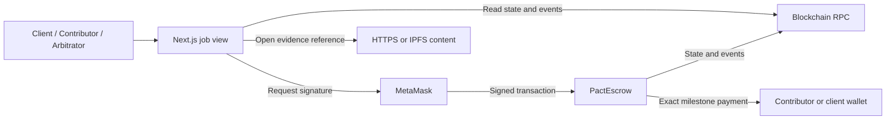
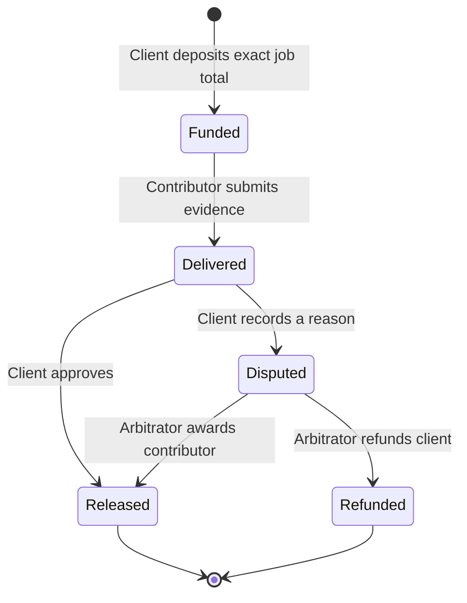

# One agreement, one source of truth

There is no central application database or service controlling funds. The contract is the source of truth. The interface re-reads it after a confirmed transaction. `lib/escrow.ts` is the single boundary between the screen and the chain; it constructs contract instances, retrieves typed data, and normalizes errors.

## State transitions

Every milestone transitions independently. Delivery cannot be overwritten after submission. A resolved milestone cannot be reopened or paid twice.

## Funds invariant

For each job:

`remaining = total funded − released − refunded`

The sum of remaining job allocations equals the ordinary tracked escrow deposits still held by the contract. Forced ETH donations could increase the contract balance without affecting allocations; no participant can spend those donations through milestone actions.

On settlement: validate role and current state → record final state and accounting → emit event → transfer exact allocation. If the recipient rejects ETH, the entire transaction rolls back. OpenZeppelin ReentrancyGuard protects create/approve/resolve calls.

## UI confirmations

The signer is checked for the intended chain. A wallet rejection leaves state unchanged. A submitted transaction gets a pending notice; only a successful receipt produces a success notice and refreshed balances. Read errors are displayed explicitly. Roles are derived from the connected wallet; disabled or hidden controls are convenience only, because the contract independently enforces authorization.

## Why these components exist

- **Solidity:** enforce allocations and permissions where funds live.
- **MetaMask:** let each person approve their own transactions without surrendering a key.
- **Next.js:** render one consistent view for all participants.
- **ethers:** encode contract calls and decode authoritative state/events.
- **Hardhat:** disposable local chain for reproducible tests and demo development.
- **solc 0.8.28:** deterministic compilation and an exportable explorer-verification input.
- **IPFS references:** bind deliverable locations to the on-chain record without placing files on-chain. Upload/pinning is a separate unfinished bonus.

Do not add infrastructure unless a required behavior demands it.
